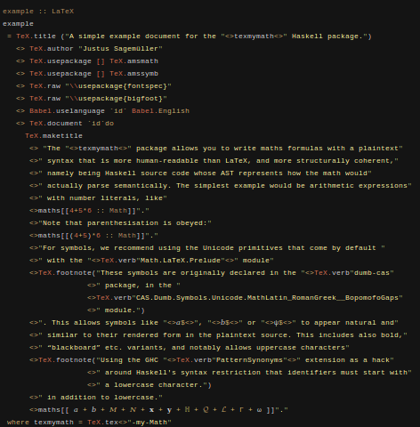

This is an attempt to get convenient math syntax in [HaTeX](https://github.com/Daniel-Diaz/HaTeX).

The idea is to combine these features:

- Full access to the math-typesetting power of LaTeX. It should be possible to express any formula that might be found in a typical mathematics or physics journal article. This should also include expression which are not quite well-defined from a programming point of view, but are clear to the intended audience.
- Idiomatic Haskell syntax. Who wants to bother with unreadable expressions involving either hundreds of double-backslashes or extra syntax overhead in wrapping them explicitly into HaTeX?
Ideally, one would write expressions as if only meaning Haskell to _calculate_ them, but get the result back as a full pretty-printing LaTeX math string. _And the actual calculated result as well_, if possible!

See [`EXAMPLES.md`](EXAMPLES.md) for how this works in practice, or [ example/Simple.hs ](example/Simple.hs) for how the library can be used for writing mathematical documents. Rendered, that looks like this:

|  |  |
